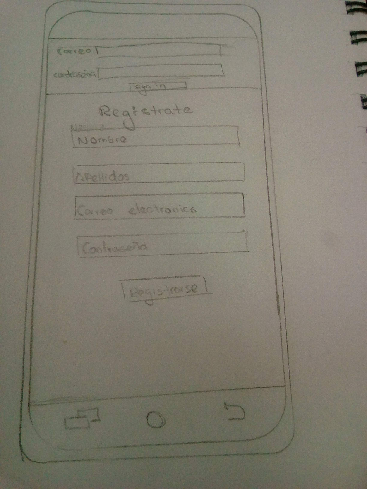
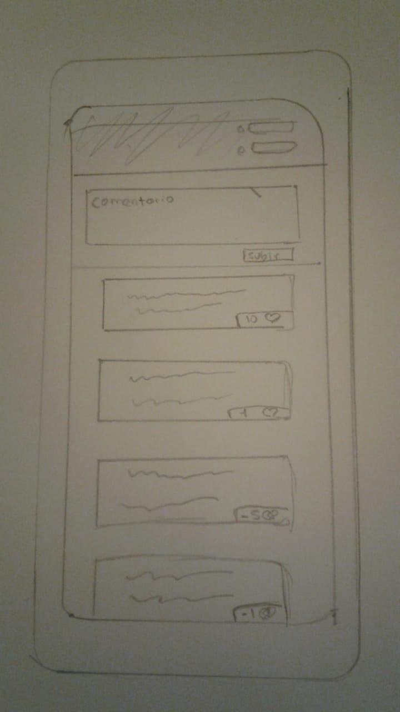
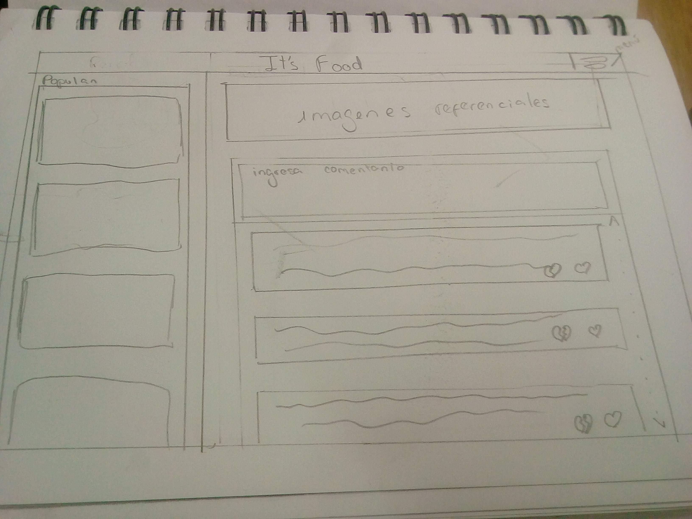
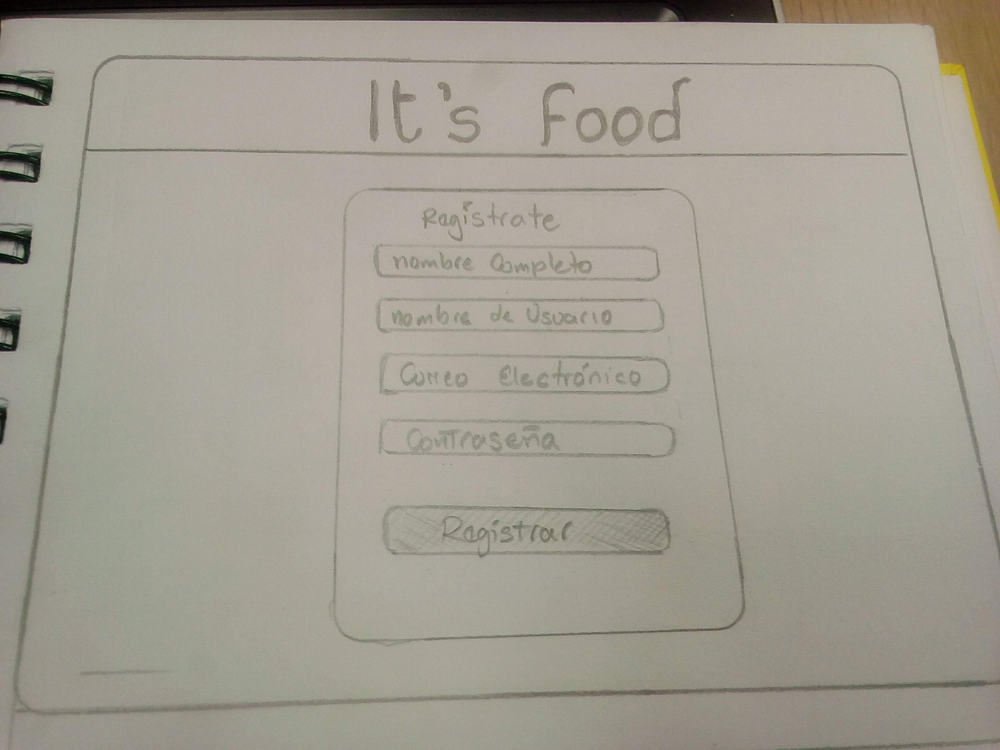

# Red Social: It's Food

## Definición del producto

It's food es una red social enfocada en el tema de la alimentación saludable, donde podrás encontrar a más personas 
que como tu están interesadas en compartir e informarse sobre tips, recetas o lugares para mejorar y/o mantener 
su salud basándose en su alimentación.

#### Elementos básicos de una red social

Realizamos una pequeña investigación de los principales puntos que a lxs usuarixs les llamaba más la 
atención de las redes sociales, encontramos que para ellxs los más importantes son: 

1. Interacción entre usuarixs: Poder publicar post, seleccionar quien o quienes los pueden ver (privacidad de post), poder darle likes a posts, tener una forma más personal de interactuar (chats).
2. Datos en realtime: Permitirle a lxs usuarixs que sus publicaciones sean instantáneas.
3. Contacto con otros: Poder comunicarse con otras personas desde cualquier lugar y hora. 

### Elección del tema

Dentro de la lista de posibles temas pensamos en usuarixs que se interesaran por ellos, investigamos en redes
sociales cada tema dado y encontramos que gran número de ellxs se interesaban o mostraban interés por su 
salud y alimentación hallando varios grupos activos dispuestos a compartir e intercambiar información 
sobre este tema. 

### Benchmark

Las páginas con temas similares o iguales al nuestro fueron:

* http://redsocialsaludable.com/ : de esta página sacamos:

##### Información destacada:

1. Colores que no se relacionaban con el tema.
2. Dificultad de encontrar los botones por no resaltar.

* http://nibbledish.com/ , https://www.gallinablanca.es/recetas/ y http://www.diariamenteali.com/notas/saludable : Estas páginas web si bien exponen sobre la salud alimentaria no se enfocaba en ella o no tienen una sección solo para la comida saludable.

##### Información destacada:

1. Exponían los comentarios y las recetas más populares.
2. En https://www.gallinablanca.es/recetas/ hay una opción de saber cual es tu peso ideal lo cual entretiene a lxs usuarixs, y le da más interés en la página.
3. En estas páginas si bien Exponen recetas o notas Saludable no se centran en ellas.

#### Conclusión de datos:

1. La página debe tener colores que den a entender desde el inicio de que se trata.
2. Mostrar de manera pública los datos más destacados.
3. Los botones o texto que llevan a algún evento deben destacar par evitar la confusión del usuarix.
4. Incluir algo que atraiga la atención al usuarix relacionado con el tema de la red social.

## Entrevistas 

Se realizaron entrevistas a 6 posibles usuarixs, para ello se plantearon las siguientes preguntas:

1. ¿Sabes en que consiste una alimentación saludable?
2. ¿Estas interesadx en tener una alimentación saludable?
3. "Una alimentación saludable es aquella que aporta todos los nutrientes esenciales y la energía que cada persona necesita para mantenerse sana." Teniendo esta definición en mente ¿Crees que tienes en una alimentación saludable?
4. ¿Cuándo comenzaste a interesarte por tu alimentación? ¿Por qué?
5. En que se basa tu alimentación (vegana, vegetariana, otra).
6. ¿Cuáles son los canales que utilizas para informarte sobre el tema? (Redes sociales, grupos, comunidades, etc).
7. ¿Compartes esa información?
8. Te gustaría una red social sobre alimentación saludable.
9. Participarías en ella.

### Síntesis de las respuestas

Todas las personas entrevistadas estaban interesadas en informarse sobre alimentación saludable, 5 de 6 entrevistadxs 
sabían en que consistía una alimentación saludable además aseguraban tenerla, 3 de ellxs habían comenzado a preocuparse a 
una edad muy temprana (12 - 17) por su alimentación para tener una mejor apariencia física y 2 por problemas de salud, 
3 de ellxs eran o habían sido vegatarianx o veganx, las redes donde se informaban eran google, facebook, youtube, instagram 
y pinterest, buscan tips, recetas y/o dietas para una mejor alimentación, les gutaría una red social de alimentación 
saludable ya que sentían que no tenían un espacio específicamente para compartir o interactuar con más público del tema.

### Necesidades de lxs usuarixs

Estas necesidades fueron halladas después del resumen de las entrevistas:

Lxs usuarixs necesitaban un lugar específico donde compartir e informarse sobre el tema, si bien hay redes donde pueden 
compartirlo aveces encontraban publicaciones que no tenían nada que ver con el tema y eso les molestaba, poder encontrar a más 
personas interesadas en lo mismo.

### Público objetivo

Con la investigación previa encontramos que nuestro público objetivo son jóvenes y adultos desde los 14 años en adelante, 
considerando que desde esa edad lxs jóvenes se empiezan a preocupar por su bienestar físico, su salud y alimentación.

### Objetivo de lxs usuarixs en relación con producto

Lxs usuarixs quieren poder compartir e intercambiar información relevante para mejorar su salud y alimentación como por ejemplo poder 
compartir recetas o lugares de comida vegetariana, vegana o baja en grasas así como su experiencia en las mismas, tips para 
ayudar a tener una mejor condición física teniendo una mejor alimentación.

### El producto resuelve las necesidades de lxs usuarixs

Con esta red social lxs usuarixs tienen una página destina únicamente a la alimentación saludable, donde pueden encontrar a más 
usuarixs interesados en los mismo, sin nada de span de otros temas.

#### Principales funcionalidades

It's food permite registrarse con su email y con google, loguearse a la página, tiene un muro con las publicaciones generales 
y otro con realizadas por uno mismo, además permite publicar post editarlos, eliminarlos, colocarles privacidad y darles like.

###  Verificación de solución de problemas

Le mostramos a posibles usuarixs la página web y preguntamos si les gustaría pertenecer a esta red social, sus respuestas
fueron afirmativas y les llamo la atención la nueva red social ya que nunca habían encontrado una similar. 

###  Cómo te asegurarás que estos usuarios usen este producto.

Se invitara a usuarixs a través de redes sociales como facebook, twitter, instagram, etc para que puedan ir animándose a 
ingresar y conocer más acerca de nuestra red social.

## Proceso de diseño

[Link prototipo móvil](https://www.figma.com/proto/D7cf3Wi4RllwGs65l24qEoPI/Untitled?node-id=41%3A298&scaling=min-zoom)
[Link prototipo ordenador](https://www.figma.com/proto/bF81QIvIdKfAtjPhXmc8w3/Untitled-(Copy)?node-id=43%3A2&scaling=min-zoom)

Al analizar el diseño de varias redes sociales muy visitadas diariamente comenzamos a pensar uno que había llamado la 
atención de lxs usuarxs para terminar el formulario de registro, dos ya logueadxs que era lo que más les llamaba la 
atención del muro o la página de inicio y tres como preferían su interacción con otrxs usuarixs ("likes, chats, etc.").

Mientras pensábamos la estructura de la página recordamos nuestras propias experiencias como usuarias y el porque habíamos
preferido unas páginas a otras, como la cantidad necesaria de información para el registro debía ser lo suficientemente 
personalizo pero no abrumador para sintetizar los puntos más importante(nombre, email, nombre de usuarix).

Además para el diseño de la web también tuvimos en cuenta que fuera lo más entendible y fácil de usar para el usuario así mismo 
como agradable al verlo mediante el móvil, con todos estos puntos en mente ideamos unos primeros bocetos.

Pasamos los sketchs de versión móvil a como se verían en el navegador.

Pasamos estos sketchs a prototipos de alta fidelidad, pero sin testear los a posibles usuarixs.

#### Móvil

#### Navegador

Después de nuestro arduo trabajo realizando el prototipado en alta fidelidad recibimos feedback de nuestro Jedi(Gonzalo), 
de compañeras y de usuarixs y casi todxs coincidian con que nuestra estructura no era tan clara como pensabamos, los 
colores estaban un poco saturados y muy pocxs encontraban elementos que para nosotras entaban a simple vista, así con ese 
feedback regresamos a la fase de idear y reeplantear nuestros sketchs.

Parte de los cambios que hicimos fueron el lugar del Sign In ya que lxs usuarixs los confundían con el título de la 
página, el fondo porque se perdían en el las zanas de ingreso de datos y el lugar de registro antes aparecía a la par del 
Sign In pero lxs usuarixs pensaban que ahí debían iniciar sesión. 

Empezamos dibujando la versión móvil y luego pasandola a la vista de navegador.

#### Móvil

#### Navegador

Después de realizar los sketch procedimos a testearlos con posibles usuarixs recibiendo respuestas positivas por la nueva 
interfaz, ya seguras que la interfaz era amigable para el usuario pasamos los sketch a prototipos de alta fidelidad.
Primero la vista de móvil y luego para nevegador.

#### Móvil

#### Navegador

### Testing con usuarios prototipo HTML

El testing inicial de la estructura de html fue desaprobado por lxs usuarixs debido a que no se podia entender el fujo de 
lo que debían hacer para ingresar, lo cual fue modificado junto con su apariencia para que el usuario tuviera más noción de 
como debia interactuar con la red social.

Testing final le brindamos la página a usuarixs para que puedan interactuar con la misma y todos supieron como registrarse, 
loguearse y publicar post pero surgieron algunas dudas con respecto a los mensajes que aparecían al momento de registrarse casi 
todxs pensaban que habían cometido algún error sin embargo no era así, el color rojo de los comentarios lxs confundía.
